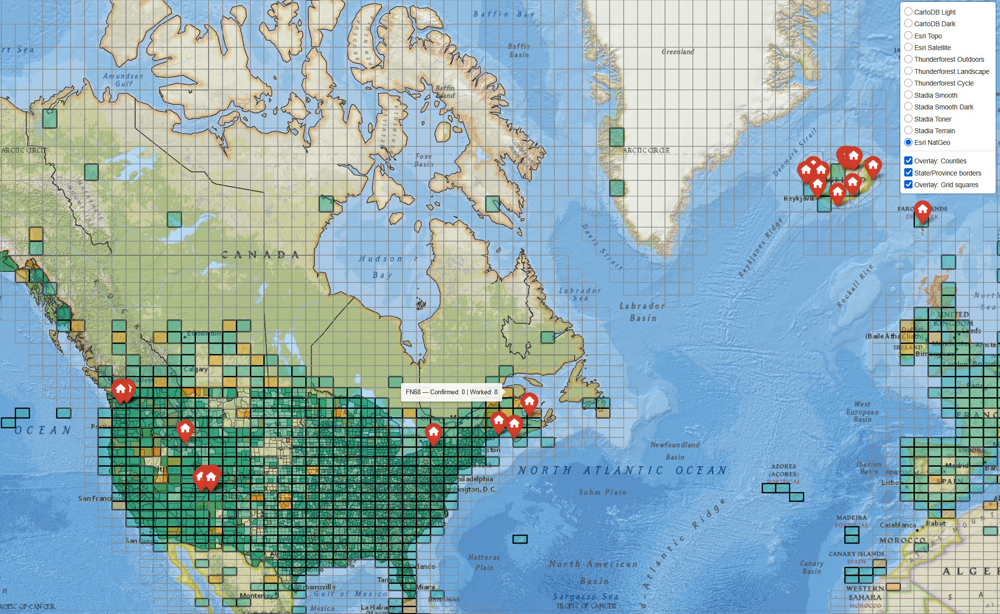
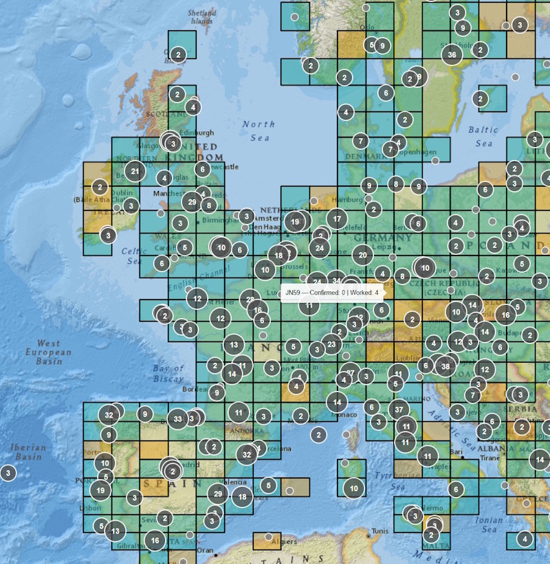
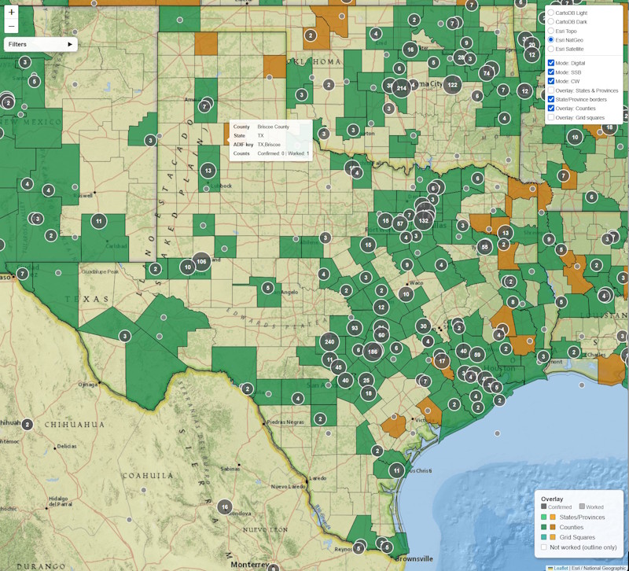

# Mapping and QRZ Logbook Tools

Logging QSLs accurately is [surprisingly complicated](https://wt8p.com/logging-amateur-radio-contacts-accurately-is-complicated/). This group of Python programs attempts to address five use cases:

1. **QRZ discrepancy correction** — QRZ identifies cases where you and the other party logged different values for Grid Square, State, and County. While it provides correction via the browser, *each record* takes 8–13 clicks. The `resolve_qrz_discrepancies.py` script lets you bulk-correct these via the QRZ API.

2. **Portable operation cleanup** — When I've worked from a park on the air or other portable site, I've sometimes (ahem) forgotten to set up the data correctly, resulting in logging as my QTH (home). We can use the same method to modify *your* Grid Square, State, and County, as well as any of the other `MY_` fields in the ADIF file. This will allow others to receive credit for your POTA activation, for example.

3. **Contact mapping** — Are you a visual person who loves maps? Want something better than the 4cm × 4cm "map" in the QRZ County Award (that does not actually show counties)? Don't want to subject your contacts to spam by signing up for another service? We have you covered. Plot your ADIF file onto a map in your browser. You can optionally add overlays for grids, counties, and states.

   POTA/SOTA folks — see where you activated with a helpful flag on the map.

   

   Dealing with logging discrepancies is a lot easier if you can see them on a map. Plot your log on an interactive browser map, with overlays for worked/confirmed states, counties, and grid squares. Originally written to visualize a two-week Iceland POTA trip.

   

4. **Geocache mapping** — I know this is not ham radio, but geocachers have the same obsession with plotting finds, hunting counties, etc. As much of this code is reusable, I added an option to plot a GSAK GPX export on an interactive map, with filters by cache type, difficulty, and terrain. Optionally overlays worked/confirmed counties and states.

   

5. **Identify differences between your [QRZ Logbook](https://logbook.qrz.com) and [LoTW (Logbook of the World)](https://lotw.arrl.org)** — This is still preliminary, but the intent is to help you find counties to fill in QRZ.

Obligatory disclaimer:
> **USE AT YOUR OWN RISK.** These are presented AS IS and without any warranty.

---

## Files

### Core scripts

| File | Purpose |
|---|---|
| `adif_extract.py` | Extracts QSOs from a QRZ ADIF export to an inspection CSV or XLSX file; supports date-range and single-date filtering |
| `resolve_qrz_discrepancies.py` | Corrects Grid, State, and County discrepancies reported by QRZ's Awards pages; also supports bulk correction of *your own* records |
| `adif_map.py` | Plots an ADIF file on a browser-based interactive map. Filter by band, mode, date, or confirmed status. Optional overlays show worked/confirmed grid squares, US states + Canadian provinces, and US counties. Supports color themes via YAML. |
| `geocache_map.py` | Plots a GSAK GPX export on an interactive map. Filter by cache type, difficulty, and terrain. Optional county/state overlays. |
| `adif_setup.py` | Downloads state and county boundary files. Run once after cloning, or to refresh boundaries. |
| `qrz_common.py` | Shared library — ADIF parsing, QRZ API client, field converters, Maidenhead grid utilities, config loading |
| `map_core.py` | Shared mapping engine — imported by `adif_map.py` and `geocache_map.py`. Not run directly. |
| `reconcile_adif.py` | Compares LoTW and QRZ ADIF exports and optionally pushes corrections to QRZ |
| `build_land_grids.py` | One-time setup script — generates `land_grids.txt`, the land-grid whitelist used by `--overlays-only` to filter ghost cells to land-adjacent grids only. Requires `shapely` (not a runtime dependency). |

### County polygon tools

| File | Purpose |
|---|---|
| `gsak_counties.py` | Builds a SQLite database of county/regional polygons from GSAK boundary files; provides point-in-polygon lookup for geocache coordinate → county assignment |
| `gsak_build_geojson.py` | Generates `us_counties.geojson` from `gsak_counties.db` — replaces the Census-derived file with higher-fidelity GSAK boundaries |
| `gsak/*` | Polygons from Geocaching Swiss Army Knife (GSAK). |

### Configuration and data files

| File | Purpose |
|---|---|
| `sample_corrections.csv` | Annotated sample CSV covering all supported `field` keywords — copy and edit for your own use |
| `requirements.txt` | Pinned dependency list — `pip install -r requirements.txt` |
| `sample.cfg` | Sample per-field rules configuration file for `reconcile_adif.py` — copy to `<CALLSIGN>.cfg` and edit |
| `theme_default.yaml` | Default color theme for `adif_map.py` and `geocache_map.py` — copy to customize band/overlay/cache-type colors and map centering |
| `location_mapping.py` | ISO 3166-1 country name ↔ code mappings, US state and Canadian province name ↔ postal code mappings. Required by `gsak_counties.py` and `map_core.py`. Not run directly. |
| `ne_states.geojson` | US + Canada state/province boundaries (Natural Earth, public domain). Used for state/province choropleth and border lines. |
| `us_counties.geojson` | US county boundaries — generated from GSAK polygon data via `gsak_build_geojson.py`. Regenerate after updating `gsak_counties.db`. |
| `land_grids.txt` | Whitelist of land-adjacent Maidenhead grid4 squares — generated by `build_land_grids.py`. Used by `adif_map.py --overlays-only` to restrict ghost (unworked) grid cells to areas near land. If absent, ghost cells fall back to the full bounding-box set. |
| `gsak_counties.db` | SQLite database of US county + Canadian regional polygons built from GSAK boundary files. Used for point-in-polygon county lookup in `geocache_map.py`. |
| `CREDITS.txt` | Attribution for all third-party data sources used by this project |

All scripts must be in the same directory. `qrz_common.py` and `map_core.py` are not run directly — they are imported by the other scripts.

---

## Requirements

```
pip install -r requirements.txt
# or individually:
pip install pandas openpyxl requests folium pyyaml pyshp
# shapely is only needed to run build_land_grids.py (one-time setup, not a runtime dependency):
pip install shapely
```

Python 3.10 or later is recommended. Library versions are intentionally conservative — for example, pandas 3.x is current but we only require 1.5+. The full list is in `requirements.txt`.

---

## First-time Setup

After cloning, you can optionally create your own boundary and county database files:

```bash
# 1. Download state/province boundary file
python adif_setup.py

# 2. Build the county polygon database from GSAK boundary files
#    (requires the gsak/ directory with US/ and CA/ polygon subdirectories)
python gsak_counties.py build --gsak-dir gsak --country US --verbose
python gsak_counties.py build --gsak-dir gsak --country CA --verbose

# 3. Generate the county GeoJSON for map rendering
python gsak_build_geojson.py

# 4. Verify lookups are working
python gsak_counties.py stats
python gsak_counties.py lookup 47.56 -122.03

# 5. (Optional) Generate the land-grid whitelist for --overlays-only grid ghost cells
#    Requires shapely (one-time only — not a runtime dependency)
pip install shapely
python build_land_grids.py
#    Takes ~60 seconds. Generates land_grids.txt beside the script.
#    If skipped, --overlays-only still works but shows all grids in the bounding box.
```

If you don't have the GSAK polygon files, `adif_setup.py` downloads a Census-derived `us_counties.geojson` as a fallback. County boundaries will be less detailed but the map will work.

---

## Callsign File Naming

The QRZ API tools use files named after your callsign (API key file, config file). Because portable callsigns can contain a `/` which is not valid in filenames, replace `/` with `_`:

| Callsign | Key file | Config file |
|---|---|---|
| `WT8P` | `WT8P.key` | `WT8P.cfg` |
| `TF/WT8P` | `TF_WT8P.key` | `TF_WT8P.cfg` |
| `WT8P/M` | `WT8P_M.key` | `WT8P_M.cfg` |

---

## API Key Setup

Create a file named `<CALLSIGN>.key` in the working directory containing your QRZ API key on a single line:

```
abcd-1234-efcd-5678
```

Your API key is found in your QRZ Logbook under **Settings → API Access Key**. When the key file exists, the `--key` argument becomes optional for both scripts.

> QRZ requires an active XML-level subscription to use the Logbook API.

---

## Quick Reference

| Script | One-liner |
|---|---|
| Map your log | `python adif_map.py mylog.adi` |
| Map with overlays and arcs | `python adif_map.py mylog.adi --overlay states,counties,grids --show-arcs` |
| Overlays only — no dots, ghost unworked cells | `python adif_map.py mylog.adi --overlay grids --overlays-only` |
| Re-enable JJ00 null-grid contacts | `python adif_map.py mylog.adi --include-null-grid` |
| Map geocaches | `python geocache_map.py caches.gpx` |
| Map geocaches with filters | `python geocache_map.py caches.gpx --show-filters --overlay counties` |
| Preview discrepancy corrections | `python resolve_qrz_discrepancies.py --xlsx qrz_errors.xlsx --adif wt8p.adi --call WT8P` |
| Apply discrepancy corrections | `python resolve_qrz_discrepancies.py --xlsx qrz_errors.xlsx --adif wt8p.adi --call WT8P --update` |
| Extract a single activation date | `python adif_extract.py --adif wt8p.adi --date 2026-03-28` |
| Reconcile LoTW vs QRZ | `python reconcile_adif.py --lotw lotw.adi --qrz wt8p.adi --call WT8P` |
| Build county DB | `python gsak_counties.py build --gsak-dir gsak --country US` |
| Regenerate county GeoJSON | `python gsak_build_geojson.py` |
| Look up a county by coordinates | `python gsak_counties.py lookup 47.56 -122.03` |

For full option reference, workflows, CSV formats, and field documentation, see **[USAGE.md](USAGE.md)**.

---

## Notes

- Always run without `--update` / `--update-qrz` first to verify matches and proposed values before writing.
- Export a fresh ADIF from QRZ before each run — `APP_QRZLOG_LOGID` values can change if records were previously updated.
- The scripts pause 1 second between API calls to avoid rate limiting.
- In some cases, bad data is reported by the other party (e.g. a grid square of "LNA"). You can mark these as bad data in your corrections file, or the API will fail silently. There is no remedy from this side.
- County polygon data is sourced from GSAK (Clyde Findlay and GSAK community contributors). See `CREDITS.txt` and `gsak/README.txt` for full attribution.
