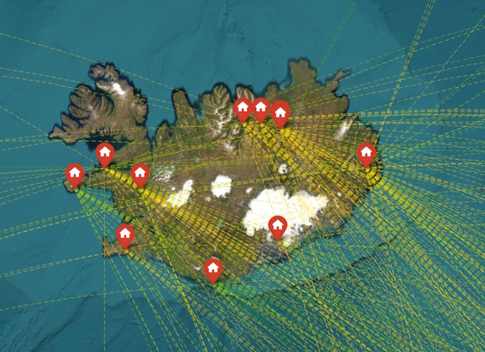
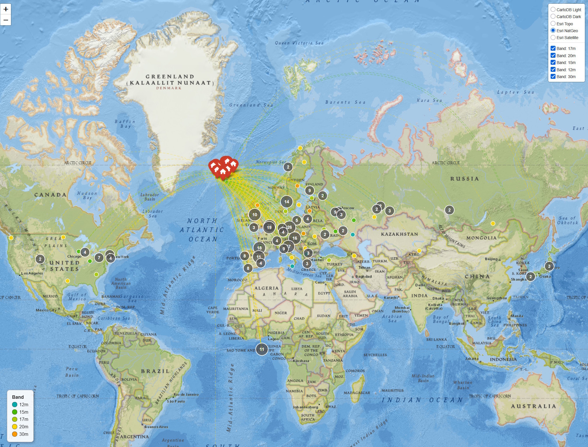

# QRZ Logbook Tools

Logging QSLs accurately is [surprisingly complicated](https://wt8p.com/logging-amateur-radio-contacts-accurately-is-complicated/).  This group of programs attempts to reconcile data discrepancies between your [QRZ Logbook](https://logbook.qrz.com) and between QRZ and [LoTW (Logbook of the World)](https://lotw.arrl.org).  It will only update the QRZ side.

## Use cases ##

1) QRZ identifies cases where you and the other party logged different values for Grid Square, State, and County — but provides no bulk-correction mechanism.  Correcting can be done from the browser, but requires 8-13 clicks *for each record*.  As someone who accumulates 40 of these a month, but cannot let it go, I've been hoping for a better way.  Here it is.

2) If you do portable operations, the veracity of QRZ data can be affected by how you upload logs.   For example, when I do a POTA, I will define a specific station location for each park, using its proper grid, county, state.  If I upload to LoTW first, then use QRZ's import from LoTW, it's *mostly correct*.  QRZ still infers the location from your QRZ, causing errors in distance.

Because LoTW can often incur processing delays, I've often forgotten and uploaded to QRZ, too.  When data is subsequently imported from to QRZ from LoTW, it does not update these fields.  Editing my records is very tedious.

These scripts provides a mechanism of bulk-correcting your own data in QRZ via the QRZ API.  They will require an API key (which you can get with a premium QRZ membership).

3) Two years ago, you spent a couple of weeks driving around Iceland, activating 11 parks, and your wanderlust wants to see the contacts on a map.  

USE AT YOUR OWN RISK.  These are presented AS IS and without any warranty.  

---

## Files

| File | Purpose |
|---|---|
| `qrz_common.py` | Shared library — ADIF parsing, QRZ API client, field converters, Maidenhead grid utilities, config loading |
| `resolve_qrz_discrepancies.py` | Corrects Grid, State, and County discrepancies reported by QRZ's Awards pages as well as allowing bulk correction of your own records. |
| `adif_extract.py` | Extracts QSOs from a QRZ ADIF export to an inspection CSV; supports date-range and single-date filtering. Produces a ready-to-edit file that feeds directly into `resolve_qrz_discrepancies.py`. |
| `adif_setup.py` | One-time setup — downloads and caches the state/province boundary file used by `--overlay states`. Run once before first use. |
| `adif_map.py` | Plots an ADIF file on a browser-based map. Your activating location(s) are shown. Filter by band, mode, date, or confirmed status. Optional overlays show worked/confirmed grid squares and US states + Canadian provinces. |
| `reconcile_adif.py` | Compares LoTW and QRZ ADIF exports and optionally pushes corrections to QRZ |
| `sample_corrections.csv` | Annotated sample CSV covering all supported `field` keywords — copy and edit for your own use |

All files must be in the same directory. `qrz_common.py` is not run directly. `adif_map.py` imports from `qrz_common.py` for ADIF parsing, grid conversion, and date normalisation. `adif_setup.py` is run once to cache boundary data for the states overlay.

---

## Requirements

```
pip install pandas openpyxl requests folium
```

Python 3.10 or later is recommended.  A requirements.txt file with instructions on creating a custom environment is provided.

There are only four non-standard libraries used and versions very conservative, e.g., Currently pandas 3.x is shipping, but we only require at least 1.5.

---

## Callsign File Naming

Both of the QSO modifying tools use files named after your callsign (API key file, config file). Because portable callsigns can contain a `/` which is not valid in filenames, replace `/` with `_`.  For example:

| Callsign | Key file | Config file |
|---|---|---|
| `WT8P` | `WT8P.key` | `WT8P.cfg` |
| `TF/WT8P` | `TF_WT8P.key` | `TF_WT8P.cfg` |
| `WT8P/M` | `WT8P_M.key` | `WT8P_M.cfg` |

---

## API Key Setup

Create a file named `<CALLSIGN>.key` in the working directory containing your QRZ API key on a single line.  If your call sign has a slant, e.g., TF/WT8P, replace that with an underscore, e.g., TF_WT8P.key.  The key will be of the format:

```
abcd-1234-efcd-5678
```

Your API key is found in your QRZ Logbook under **Settings → API Access Key**. When the key file exists, the `--key` argument becomes optional for both scripts.

> QRZ requires an active XML-level subscription to use the Logbook API.

---

## `resolve_qrz_discrepancies.py`

Reads the discrepancy report exported from QRZ's Awards pages and applies the other party's values to your QRZ records via the API. Works on both unconfirmed records and confirmed/award-locked records.

It can also be used to bulk update your own records.

> **Dry-run mode is the default.** No changes are written to QRZ unless you pass `--update` explicitly. Always review the output CSV before running with `--update`.

### Quick Start

**1. Export from QRZ**

- **ADIF export:** Logbook → Settings → Export.   Wait.  Click Settings again to refresh.  Save the `.adi` file.
- **Discrepancy report:** Logbook → Awards → United States Counties Award → Details → Export. Save as Excel (`.xlsx`).

**2. Find discrepancies in QRZ**

There is no bulk export option for these.  Rather, rather we visit the Awards page for each.

    Awards → Click on your call sign → Click on United States Counties Award → 

Select and copy the table displayed.  Repeat this for these pages:

    Awards → Click on your call sign → Click on Grid Squared Award → 
    Awards → Click on your call sign → Click on United States Counties → 

**2. Preview first (dry-run is the default)**

```bash
python resolve_qrz_discrepancies.py \
    --xlsx  qrz_errors.xlsx \
    --adif  wt8p.adi \
    --call  WT8P
```

**3. Apply corrections**

```bash
python resolve_qrz_discrepancies.py \
    --xlsx  qrz_errors.xlsx \
    --adif  wt8p.adi \
    --call  WT8P \
    --update
```

### All Options

```
--xlsx <file>               QRZ discrepancy Excel file (mutually exclusive with --input-csv)
--input-csv <file>          Flat CSV instead of Excel (see CSV Format below)
--adif <file>               Your QRZ ADIF export (must contain APP_QRZLOG_LOGID)
--call <callsign>           Your callsign (e.g. WT8P or TF/WT8P)
--key <api-key>             QRZ API key — optional if <CALLSIGN>.key file exists
--update                    Apply changes to QRZ (default is dry-run — preview only)
--derive-coords             Derive related fields automatically (see Coordinate Derivation below)
--grid-precision {4,6,8}    Maidenhead precision when deriving grid from coordinates (default: 6)
--output-csv <file>         Output CSV log (default: resolved_log.csv)
```

### Input: Excel

The Excel file can contain named sheets from the QRZ discrepancy export as well as an optional `MISC` sheet for anything else.

**Named sheets** (always correct the other party's fields):

| Sheet | ADIF field corrected |
|---|---|
| `Grids` | `GRIDSQUARE` |
| `State` | `STATE` |
| `County` | `CNTY` |

Column headers are matched by prefix, so `You Entered county`, `You Entered grid`, etc. all work. Rows where `Note` = `Bad Data` are skipped automatically.

**MISC sheet** (optional, supports all field keywords):

Add a sheet named `MISC` to your workbook with the same column format as the flat CSV: `field`, `qso_date`, `qso_with`, `new_value`, and optionally `note`. This sheet accepts every field keyword listed in the CSV Field Reference below — including `MY_GRIDSQUARE`, `MY_LOC`, `MY_LAT`/`MY_LON`, `MY_STATE`, `MY_CNTY`, and `COMMENT` — making it the easiest way to correct your own station fields from within the same Excel workbook. The `--derive-coords` and `--grid-precision` options apply to MISC sheet rows exactly as they do to CSV rows. Blank rows and rows whose first cell starts with `#` are skipped.

### Input: Flat CSV (`--input-csv`)

All discrepancy types in a single file. The `field` column indicates which ADIF field to correct.

**Required columns:** `field`, `qso_date`, `qso_with`, `new_value`

**Optional columns:** `you_entered`, `de`, `note` (`Bad Data` to skip a row)

Column names are case-insensitive. Common aliases accepted: `call` for `qso_with`, `adif_field` for `field`, `other_party_entered` or `other_value` for `new_value`.

#### CSV Field Reference and Examples

The following example covers all supported `field` keywords. W1AW (the ARRL club station in Newington, CT) is used as the example contact.

> Comment lines (beginning with `#`) and blank lines are silently skipped,
> so you can annotate your CSV freely. The `sample_corrections.csv` file
> included in this repository is a ready-to-edit starting point.

```csv
field,qso_date,qso_with,new_value,note

# ── Other party's fields ──────────────────────────────────────────────────────
# Correct the other party's grid square.
GRIDSQUARE,2024-07-06 20:28:00,W1AW,FN31

# Correct the other party's state. Non-standard abbreviations (e.g. TEN → TN)
# are normalised automatically.
STATE,2017-10-28 15:14:00,W1AW,CT

# Correct the other party's county. Supply the QRZ display format, quoted
# because it contains a comma. "County", "Borough" (AK), and "Parish" (LA)
# are stripped automatically and the value converted to ADIF format.
CNTY,2025-08-11 02:22:00,W1AW,"Hartford County, CT"

# Mark a row as bad data to skip it without removing it from the file.
GRIDSQUARE,2024-03-01 14:00:00,W1AW,LNA,Bad Data

# ── Your own station's fields ────────────────────────────────────────────────
# Use the MY_ prefix directly — no flag needed.

# Your grid square
MY_GRIDSQUARE,2025-08-11 02:22:00,W1AW,CN87xn

# Your state and county
MY_STATE,2025-08-11 02:22:00,W1AW,WA
MY_CNTY,2025-08-11 02:22:00,W1AW,"King County, WA"

# ── Coordinates: separate rows ────────────────────────────────────────────────
# MY_LAT and MY_LON accept decimal degrees or ADIF native format.
# Positive lat = North, negative = South.
# Positive lon = East,  negative = West.
MY_LAT,2025-08-11 02:22:00,W1AW,47.5625
MY_LON,2025-08-11 02:22:00,W1AW,-122.058

# ── Coordinates: combined row (MY_LOC) ────────────────────────────────────────
# MY_LOC sets both MY_LAT and MY_LON from a single row.
# The "lat,lon" value must be quoted so the comma is not treated as a column
# separator. This expands into two separate MY_LAT and MY_LON updates.
# With --derive-coords it also derives and updates MY_GRIDSQUARE.
MY_LOC,2025-08-11 02:22:00,W1AW,"47.5625,-122.058"

# ── Grid square with coordinate derivation (--derive-coords) ──────────────────
# When --derive-coords is active, a MY_GRIDSQUARE row also emits MY_LAT
# and MY_LON updates derived from the centre of the specified grid square.
# Useful when your logging app reports a precise grid and you want all
# three fields updated consistently.
MY_GRIDSQUARE,2025-08-11 02:22:00,W1AW,CN87xn

# ── Comment field ──────────────────────────────────────────────────────────────
# COMMENT sets the QRZ logbook comment.
# Useful for adding or correcting POTA/SOTA park references logged in the field.
COMMENT,2026-03-28 16:35:00,AB0LV,US-3263 Scenic Beach State Park WA
```

**Summary of `field` keywords and what they update:**

| `field` value | Updates | Notes |
|---|---|---|
| `GRIDSQUARE` | `GRIDSQUARE` | Other party's grid |
| `STATE` | `STATE` | Other party's state; non-standard abbrevs normalised |
| `CNTY` | `CNTY` | Other party's county; quoted QRZ display format: `"Hartford County, CT"` |
| `MY_GRIDSQUARE` | `MY_GRIDSQUARE` | Your grid; also `MY_LAT` + `MY_LON` with `--derive-coords` |
| `MY_STATE` | `MY_STATE` | Your state |
| `MY_CNTY` | `MY_CNTY` | Your county; quoted QRZ display format: `"King County, WA"` |
| `MY_LAT` | `MY_LAT` | Your latitude (decimal or ADIF native format) |
| `MY_LON` | `MY_LON` | Your longitude (decimal or ADIF native format) |
| `MY_LOC` | `MY_LAT` + `MY_LON` | Combined lat/lon — value must be quoted `"lat,lon"`; also updates `MY_GRIDSQUARE` with `--derive-coords` |
| `COMMENT` | `COMMENT` | QRZ logbook comment (free text) |

### Correcting Your Own Station's Fields

Use the `MY_` prefix in the `field` column to correct your own station fields — no special flag is needed. `MY_GRIDSQUARE`, `MY_STATE`, `MY_CNTY`, `MY_LAT`, `MY_LON`, and `MY_LOC` are all valid keywords in both the flat CSV and the Excel `MISC` sheet.

**`MY_LAT` and `MY_LON`** accept either decimal degrees or ADIF native format:

| Format | Example | Meaning |
|---|---|---|
| Decimal, positive lat | `47.5625` | North |
| Decimal, negative lat | `-47.5625` | South |
| Decimal, positive lon | `122.058` | East |
| Decimal, negative lon | `-122.058` | West |
| ADIF native | `N047 33.750` | North 47° 33.750' |
| ADIF native | `W122 03.480` | West 122° 03.480' |

### Coordinate Derivation (`--derive-coords`)

When `--derive-coords` is active, the script automatically derives related fields so that your grid square and coordinates stay in sync:

- **`MY_LOC` row** — expands to `MY_LAT` + `MY_LON` updates (always), and also derives and updates `MY_GRIDSQUARE` from those coordinates.
- **`MY_GRIDSQUARE` row** — updates the grid square (always), and also derives and updates `MY_LAT` + `MY_LON` from the centre point of the specified grid square.

Use `--grid-precision` to set the number of Maidenhead characters when deriving a grid from coordinates:

| Precision | Characters | Approximate resolution |
|---|---|---|
| 4 | e.g. `CN87` | ~55 km |
| 6 | e.g. `CN87xn` | ~460 m (default) |
| 8 | e.g. `CN87xn35` | ~4 m |

> **Note:** When deriving coordinates *from* a grid square, the grid must be at least 6 characters — a 4-character grid spans ~55 km and is rejected as too coarse. The lat/lon written to QRZ is the centre point of the square, which for a 6-character grid can be up to ~230 m from your actual position. If precision matters, use `MY_LOC` with your actual decimal coordinates and let `--derive-coords` derive the grid from those.

```bash
# Field operation: app gives you a precise grid — update all three fields
python resolve_qrz_discrepancies.py \
    --input-csv my_corrections.csv \
    --adif wt8p.adi \
    --call WT8P \
    --derive-coords \
    --grid-precision 6
```

### Output CSV (`resolved_log.csv`)

| Column | Description |
|---|---|
| `sheet` | Source sheet (`Grids`, `State`, `County`) |
| `adif_field` | ADIF field corrected |
| `qso_with` | Other party's callsign |
| `qso_date` | YYYYMMDD |
| `time_on` | HHMM |
| `logid` | QRZ internal record ID |
| `old_value` | Value in QRZ before correction |
| `new_value` | Value applied (in ADIF format) |
| `status` | `updated` \| `dry_run` \| `no_change` \| `skipped_bad_data` \| `no_match` \| `error` |
| `error_msg` | Failure detail, blank on success |

### Field Format Conversions

**County (`CNTY` / `MY_CNTY`):** Supply the value in QRZ display format, quoted because it contains a comma: `"Hartford County, CT"`. The script converts it to ADIF format (`ST,County Name`) before writing to QRZ. The word `County` is stripped automatically; for Alaska `Borough` is also stripped (e.g. `"Anchorage Borough, AK"` → `AK,Anchorage`), and for Louisiana `Parish` is stripped.

**State (`STATE`):** Non-standard abbreviations (e.g. `IND` → `IN`) are automatically normalised to 2-letter ADIF values.

### How It Works

The script uses `ACTION=INSERT` with `OPTION=REPLACE` on the QRZ API. Including `APP_QRZLOG_LOGID` in the ADIF payload causes QRZ to replace the existing record in place, returning `RESULT=REPLACE`. This works on both unconfirmed and confirmed/award-locked records — unlike `ACTION=DELETE`, which fails silently on locked records.

Records are matched using: **Callsign + Date + Time (HHMM)**.

---

## `adif_extract.py`

Extracts QSOs from a QRZ ADIF export to an inspection CSV, with optional date-range or single-date filtering. Designed for the common portable-operations workflow: export a range of contacts from QRZ, spot-check `MY_` fields and `COMMENT` in Excel, fill in corrections, then feed the result back to `resolve_qrz_discrepancies.py`.

Does not call the QRZ API and requires no API key.

### Quick Start

**1. Extract a single activation date**

```bash
python adif_extract.py --adif wt8p.adi --date 2026-03-28
```

**2. Extract a date range**

```bash
python adif_extract.py --adif wt8p.adi --after 2026-03-20 --before 2026-03-31 --output-csv march_pota.csv
```

**3. Open the CSV in Excel, review and fill in corrections**

The `field` and `new_value` columns are blank — add the field to correct and its new value on each row. Duplicate a row if the same QSO needs multiple corrections. Delete rows you don't need to change.

**4. Feed the edited CSV to resolve_qrz_discrepancies.py**

```bash
python resolve_qrz_discrepancies.py \
    --input-csv march_pota.csv \
    --adif wt8p.adi \
    --call WT8P \
    --derive-coords
```

### All Options

```
--adif <file>           QRZ ADIF export file (required)
--date <DATE>           Extract a single date — shorthand for --after DATE --before DATE
                        Mutually exclusive with --after.
--after <DATE>          Include QSOs on or after this date (inclusive)
--before <DATE>         Include QSOs on or before this date (inclusive)
--output-csv <file>     Output CSV filename (default: adif_extract.csv)
```

Date formats accepted for all date arguments: `YYYY-MM-DD` or `YYYYMMDD`.

### Output CSV Columns

| Column | Description |
|---|---|
| `field` | **Blank — fill in** the ADIF field name to correct (e.g. `MY_GRIDSQUARE`, `COMMENT`) |
| `qso_date` | QSO date in `YYYY-MM-DD` format |
| `time_on` | QSO time in `HH:MM` format |
| `call` | Contacted station callsign |
| `MY_GRIDSQUARE` | Your grid square as logged |
| `MY_LAT` | Your latitude (ADIF format) |
| `MY_LON` | Your longitude (ADIF format) |
| `MY_STATE` | Your state |
| `MY_CNTY` | Your county (ADIF format, e.g. `WA,Kitsap`) |
| `MY_CITY` | Your city |
| `MY_COUNTRY` | Your country |
| `MY_CQ_ZONE` | Your CQ zone |
| `MY_ITU_ZONE` | Your ITU zone |
| `MY_DXCC` | Your DXCC entity code |
| `MY_NAME` | Your name as logged |
| `COMMENT` | QRZ logbook comment |
| `new_value` | **Blank — fill in** the corrected value |

### Typical POTA / Portable Workflow

When logging in the field, apps like N3FJP or WSJT-X may capture your grid automatically but sometimes use your home location for lat/lon, or a QRZ upload can overwrite the correct grid with your default location. The typical correction flow is:

1. After an activation, export your full QRZ ADIF (or use a previous export if it's current).
2. Run `adif_extract.py --date <activation-date>` to pull just that day's QSOs.
3. In Excel: verify `MY_GRIDSQUARE`, `MY_LAT`, `MY_LON`, and `COMMENT`. For each field that needs correcting, set `field` = the ADIF field name and `new_value` = the correct value.
4. Save as CSV and run `resolve_qrz_discrepancies.py --input-csv ... --derive-coords`. With `--derive-coords`, a single `MY_GRIDSQUARE` correction (6+ characters) will also update `MY_LAT` and `MY_LON` from the grid centre automatically.

---

## `reconcile_adif.py`

Compares a LoTW ADIF export against a QRZ ADIF export for the same callsign, identifies field-level discrepancies, and optionally pushes corrections to QRZ.

> **Important:** Export only *confirmed* QSOs from LoTW. In LoTW, use **Search QSOs → QSL Rcvd = Yes** before downloading. The script also checks `APP_LOTW_2XQSL=Y` as a safety net, but the export filter is the primary mechanism.

### Quick Start

**1. Export your logs**

- **LoTW:** Download confirmed QSOs as ADIF (all callsigns can be in one file).
- **QRZ:** Logbook → Settings → Export. One file per callsign/logbook.

**2. Compare only (no API writes)**

```bash
python reconcile_adif.py \
    --lotw  lotw_confirmed.adi \
    --qrz   wt8p.adi \
    --call  WT8P
```

This produces `corrected_qrz.adi` (for manual import) and `reconciliation_report.csv`.

**3. Compare and push corrections to QRZ**

```bash
python reconcile_adif.py \
    --lotw  lotw_confirmed.adi \
    --qrz   wt8p.adi \
    --call  WT8P \
    --update-qrz \
    --dry-run
```

Remove `--dry-run` to apply live.

### All Options

```
--lotw <file>           LoTW ADIF export (confirmed QSOs only)
--qrz <file>            QRZ ADIF export (must contain APP_QRZLOG_LOGID)
--call <callsign>       Callsign to process — filters LoTW by STATION_CALLSIGN
--config <file>         Field rules config file (default: <CALLSIGN>.cfg)
--update-qrz            Push corrections to QRZ via API
--key <api-key>         QRZ API key — optional if <CALLSIGN>.key file exists
--dry-run               Preview corrections without writing to QRZ
--output-adif <file>    Corrected ADIF output (default: corrected_qrz.adi)
--output-csv <file>     Report CSV (default: reconciliation_report.csv)
```

### Multiple Callsigns

LoTW can export all your callsigns in a single file. The `--call` argument filters the export to only the records for that callsign's `STATION_CALLSIGN`. Run the script once per callsign, pointing `--qrz` at the corresponding QRZ export each time.

### Fields Compared

| Field | Default Rule | Notes |
|---|---|---|
| `GRIDSQUARE` | `lotw_wins` | First 4 chars compared (QRZ may have more precision) |
| `COUNTRY` | `fill_blank` | Only fills if QRZ field is empty |
| `DXCC` | `lotw_wins` | Compared as integer |
| `CQZ` | `lotw_wins` | Compared as integer, leading zeros ignored |
| `ITUZ` | `lotw_wins` | Compared as integer, leading zeros ignored |
| `MODE` | `flag_only` | Reported but not auto-corrected |
| `STATE` | `lotw_wins` | US contacts only (`DXCC=291`); skipped if value is numeric |
| `CNTY` | `lotw_wins` | US contacts only; skipped if value is numeric |
| `MY_COUNTRY` | `lotw_wins` | Normalises verbose names (e.g. `UNITED STATES OF AMERICA` → `United States`) |
| `MY_CQ_ZONE` | `lotw_wins` | Integer comparison |
| `MY_ITU_ZONE` | `lotw_wins` | Integer comparison |
| `MY_DXCC` | `lotw_wins` | Integer comparison |
| `MY_STATE` | `lotw_wins` | |
| `MY_CNTY` | `lotw_wins` | |
| `APP_LOTW_RXQSL` | `fill_blank` | Maps to `LOTW_QSL_RCVD` in QRZ |

### Configuration File

Per-field rules can be customised in a config file named `<CALLSIGN>.cfg` (e.g. `WT8P.cfg`). See the sample config file (`sample.cfg`) included in this repository.

**Valid rules:**

| Rule | Behaviour |
|---|---|
| `lotw_wins` | Apply LoTW value to QRZ record regardless of existing QRZ value |
| `fill_blank` | Only apply LoTW value if QRZ field is empty |
| `flag_only` | Report the difference in the CSV but do not correct |
| `skip` | Ignore this field entirely |

### Output: CSV Report (`reconciliation_report.csv`)

One row per field-level discrepancy found. Clean records with no discrepancies are omitted.

| Column | Description |
|---|---|
| `call` | Other party's callsign |
| `qso_date` | YYYYMMDD |
| `time_on` | HHMM |
| `band` | Band |
| `mode` | Mode |
| `logid` | QRZ record ID |
| `field` | ADIF field name |
| `lotw_value` | Value from LoTW |
| `qrz_value` | Value currently in QRZ |
| `rule` | Rule applied (`lotw_wins`, `fill_blank`, etc.) |
| `action` | `corrected` \| `flagged` \| `skipped` |
| `record_status` | `ok` \| `updated` \| `dry_run` \| `no_match` \| `error` |
| `error_msg` | Failure detail if applicable |

### Output: Corrected ADIF (`corrected_qrz.adi`)

Contains only records with at least one `corrected` field change. Can be imported into QRZ manually via **Logbook → Settings → ADIF Import** as an alternative to `--update-qrz`.

---

## `adif_map.py` 

Plots an ADIF file on a map in your browser (in a local file).  

> **Important:** You probably want to use adif_extract.py to pull a subset.  I've tested it with 35k contacts, and it's pretty slow to process, but did work.  

### Overlays

The `--overlay` flag adds choropleth layers showing which grid squares or states/provinces you've worked, colour-coded by confirmation status:

| Colour | Meaning |
|---|---|
| Green | At least one confirmed QSO (LoTW or QSL received) |
| Amber | Worked but no confirmed QSO |
| White (no polygon) | Not worked under the current filter |

```bash
# Grid squares only
python adif_map.py mylog.adi --overlay grids

# States and provinces only
python adif_map.py mylog.adi --overlay states

# Both at once
python adif_map.py mylog.adi --overlay grids,states

# Combine with filters — overlay reflects only the filtered set
python adif_map.py mylog.adi --band 20m --confirmed --overlay grids,states
```

**Grid squares** are generated entirely in Python from the `GRIDSQUARE` field (4-character precision, e.g. FN31). Only squares that appear in your filtered log are drawn — no external data file required.

**States and provinces** (US + Canada) are read from `ne_states.geojson`, a cached boundary file downloaded by `adif_setup.py`. Run that script once before first use. The overlay reads the `STATE` field and `DXCC` code from each QSO record (`DXCC=291` for US, `DXCC=1` for Canada).

Both overlays are independently toggleable in the map's layer control.

### Quick Start

**1. Get your ADIF file**

Any ADIF file will work — a QRZ export, a LoTW download, or the output of `adif_extract.py`. The map reads `MY_LAT`/`MY_LON` or `MY_GRIDSQUARE` per record to determine your transmit location, so portable operations with multiple operating sites are handled automatically.

**2. Plot contacts**

```bash
python adif_map.py mylog.adi
```

This produces `map_output.html` in the same directory as the ADIF file and opens it in your default browser.

### All Options

```
--band <BAND>            Filter by band (e.g., 40M, 20m)
--mode <MODE>            Filter by mode (e.g., SSB, CW, FT8)
--date-from <DATE>       Filter QSOs on or after date (YYYYMMDD or YYYY-MM-DD)
--date-to <DATE>         Filter QSOs on or before date (YYYYMMDD or YYYY-MM-DD)
--confirmed              Only show confirmed QSOs (LoTW or QRZ)
--no-arcs                Suppress great-circle arcs
--cluster-by-band        Separate cluster bubble per band, toggleable via layer control
--overlay <LIST>         Comma-separated overlays: grids, states (e.g. --overlay grids,states)
--output <file>          Output html file name (default: map_output.html)
```

The map will look at each QSO for your location, then plot those on a map.  For example, during a trip around Iceland, I activated 11 parks.  Arcs project from each to the other station.



Output file example is below:

## `qrz_common.py` — Shared Library

This file is used by all scripts and is not run directly. It provides:

- **ADIF parser** — `parse_adif_file()` for QSO records; `parse_adif_with_header()` also returns header-level fields (used by `adif_map.py` for `MY_LAT`/`MY_LON`/`MY_GRIDSQUARE`); handles HTML-escaped brackets from QRZ API responses
- **QRZ API client** — `ACTION=INSERT OPTION=REPLACE` for in-place updates
- **Key file loader** — reads `<CALLSIGN>.key`, maps `/` to `_` in filenames
- **Config file loader** — reads `<CALLSIGN>.cfg` for per-field rules
- **Field converters** — `CNTY` display-to-ADIF format, `STATE` normalisation, coordinate validation
- **Maidenhead grid utilities** — `latlon_to_grid()` converts decimal coordinates to a 4-, 6-, or 8-character grid locator; `grid_to_latlon()` converts a grid locator back to the decimal lat/lon of its centre point; `adif_latlon_to_decimal()` converts ADIF `N/S/E/W DDD MM.MMM` coordinate strings to decimal degrees
- **Date/time normalisation** — `parse_qso_datetime()` accepts both ADIF compact format (`YYYYMMDD` / `HHMM`, as found in QRZ exports) and human-readable format (`YYYY-MM-DD` / `HH:MM`), used by all scripts; `format_qso_datetime()` converts ADIF compact to human-readable for CSV output
- **Field comparison utilities** — integer normalisation, gridsquare prefix matching, country name mapping

---

## Notes

- Always run without `--update` first to verify matches and proposed values before writing.
- Export a fresh ADIF from QRZ before each run — `APP_QRZLOG_LOGID` values can change if records were previously updated.
- The scripts pause 1 second between API calls to avoid rate limiting.
- For `reconcile_adif.py`, unmatched LoTW records (no corresponding QRZ entry) are logged in the CSV as `no_match` — this is normal for contacts logged in LoTW before you joined QRZ, or contacts the other party hasn't logged in QRZ.
- QRZ's user interface will report counties with "County" or "Borough" (Alaska only), which differs from what is contained in the ADIF file.  We will strip that off for you, so no worries.
- In some cases, bad data is reported by the other person.  For example, if a user specifies their grid as "LNA."  You can mark these as bad data, or the API will simply fail silently.  There's really no remedy from our side.
